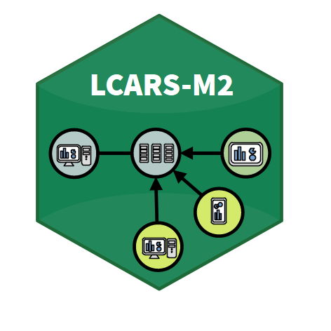
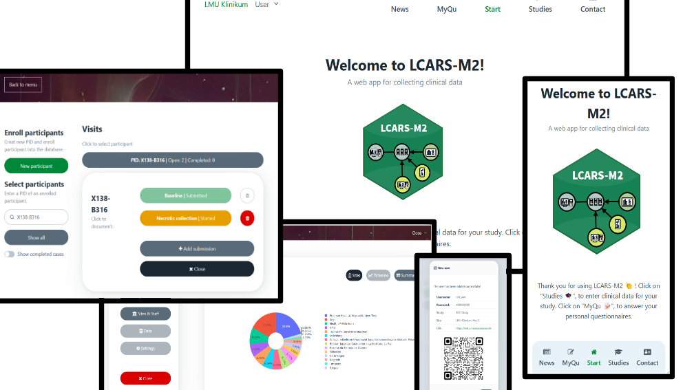
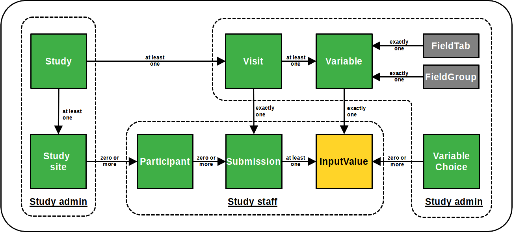

 -67%25-yellow.svg)
# LCARS-M2 
LCARS-M2 is a lightweight clinical data acquisition and management software for clinical research and other data-focused research projects. It is a [progressive web app](https://en.wikipedia.org/wiki/Progressive_web_app) and based on [python](https://www.python.org/)/[django](https://www.djangoproject.com/).

### 🚀 The source code will be published here shortly. 🚀

Please refer to the R based protoype (LCARS-C) [here](https://github.com/hcstubbe/lcarsc).

## User interface
The following illustrates screenshots of LCARS-M2 modules.

 

## Data model
This figure shows an overview of the core data model.

 

